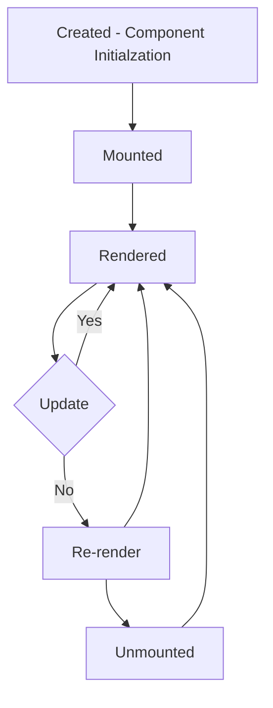
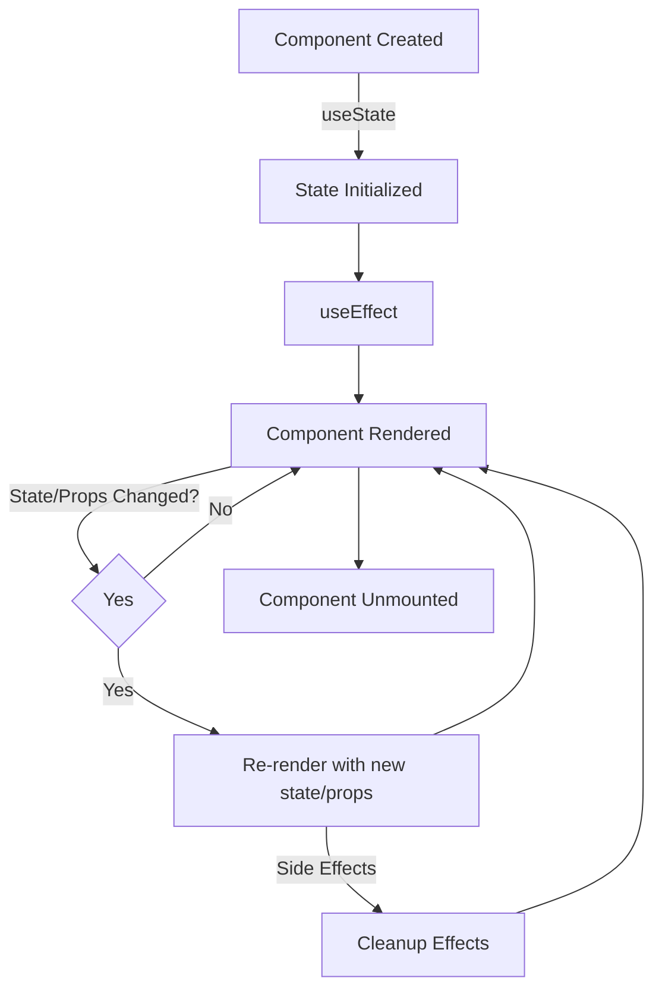

# useEffect hook and Firebase Database

## useEffect Hook

### Lifecycle of React Component
The lifecycle of a React component refers to the series of phases or events that occur from its initialization to its removal from the DOM (Document Object Model). React components have several lifecycle methods that developers can use to hook into these different phases. However, with the introduction of React Hooks, some of these lifecycle methods have been replaced by more functional equivalents.
Ref docs: https://react.dev/learn/lifecycle-of-reactive-effects


### useEffect Hook
`useEffect` is one of the most commonly used Hooks in React. It enables developers to perform side effects in functional components. Side effects can include data fetching, subscriptions, or manually changing the DOM in reaction to state changes.

The `useEffect` Hook takes two arguments:

1.  A callback function: This function contains the code that performs the side effect.
2.  An optional array of dependencies: This array specifies values (usually props or state variables) that the effect depends on. If any of these values change, the effect will re-run. If this array is omitted, the effect will run after every render.

Ref Docs: https://react.dev/reference/react/useEffect




## Firebase Database

Firebase Realtime Database is like a cloud-based storage for your web application's data. It's as if you have a big digital whiteboard where you can write down information in a special format called JSON. This data is then automatically updated and shared in real-time with all the users who are using your web application.

So, when you're building your web app with React JS and Firebase, it's like creating a shared space where all your users can see the same information at the same time, just like looking at the same whiteboard. Whenever someone writes something new, everyone else sees it instantly without needing to refresh the page.

This real-time synchronization makes your web app dynamic and interactive, as users can see changes happening in real-time without any delay. Plus, integrating Firebase with React JS is straightforward, allowing you to focus more on building your app's features rather than worrying about the backend infrastructure.
Ref docs: https://firebase.google.com/docs/database/web/start

#### Get a database reference
Import `getDatabase`, create instance of `database` inside`\src\config\firebase-config` file and export `database` instance
```
import  { getDatabase } from "firebase/database";  
const  firebaseConfig  = {
	// firebase config goes here...
};
// Initialize Firebase
const  firebase_app  =  initializeApp(firebaseConfig);
  
const database = getDatabase(firebase_app);

export { firebase_app, database};
```

####  Write data
When you're working with Firebase, you often need to retrieve data from the database. To do this, you attach a listener to a specific part of the database, known as a `firebase.database.Reference`.

- This listener is asynchronous, meaning it continues doing other tasks while waiting for data.
- Initially, it fetches the current data from the reference.
- Afterwards, it remains active. If there are any changes in the data at that reference, the listener triggers an event, notifying your program.

Think of it like having a special ear on a specific spot on a whiteboard. Initially, you hear what's written there. Then, as changes are made to that spot, you're immediately informed. This approach ensures your app stays synchronized with the database without repeatedly asking for updates.

#### Basic write operations
For basic write operations, you can use `set()` to save data to a specified reference, replacing any existing data at that path. For example a social blogging application might add a user with `set()` as follows:
```
import { ref, set} from  "firebase/database";
import { database } from  "../config/firebase-config";

const submit_handle = () => {
    set(ref(database, `messages/${new_message_key}`), {
      text: user_input,
    }).then((res) => {
      //   alert("Message sent");
    });
  };
```
#### Writing lists

##### Append to a list of data
Use the  `push()`  method to append data to a list in multiuser applications. The  `push()`  method generates a unique key every time a new child is added to the specified Firebase reference. By using these auto-generated keys for each new element in the list, several clients can add children to the same location at the same time without write conflicts. The unique key generated by  `push()`  is based on a timestamp, so list items are automatically ordered chronologically.

You can use the reference to the new data returned by the  `push()`  method to get the value of the child's auto-generated key or set data for the child. The  `.key`  property of a  `push()`  reference contains the auto-generated key.

Ref docs: https://firebase.google.com/docs/database/web/lists-of-data#reading_and_writing_lists


```
import { child, onValue, push, ref, set } from  "firebase/database";
import { database } from  "../config/firebase-config";


const submit_handle = () => {
    const new_message_key = push(child(ref(database), "messages")).key;
    set(ref(database, `messages/${new_message_key}`), {
      text: user_input,
      key: new_message_key,
    }).then((res) => {
      //   alert("Message sent");
    });
  };
```
#### Read data
##### Listen for value events

To read data at a path and listen for changes, use  `onValue()`  to observe events. You can use this event to read static snapshots of the contents at a given path, as they existed at the time of the event. This method is triggered once when the listener is attached and again every time the data, including children, changes. The event callback is passed a snapshot containing all data at that location, including child data. If there is no data, the snapshot will return  `false`  when you call  `exists()`  and  `null`  when you call  `val()`  on it.
Ref Docs: https://firebase.google.com/docs/database/web/read-and-write#read_data

PS: We have used useEffect hook to fetch messages:
```
import { database } from  "../config/firebase-config";
import { onValue, ref} from  "firebase/database";

 useEffect(() => {
    const database_ref = ref(database, "messages/");
    onValue(database_ref, (snapshot) => {
      const data = snapshot.val();
      const convert_to_array = Object.values(data);
      setMessages_data(convert_to_array);
      console.log(data);
    });
  }, []);
```
#### Updating data

To simultaneously write to specific children of a node without overwriting other child nodes, use the  `update()`  method.

[](https://firebase.google.com/docs/database/web/read-and-write)When calling  `update()`, you can update lower-level child values by specifying a path for the key. If data is stored in multiple locations to scale better, you can update all instances of that data using  [data fan-out](https://firebase.google.com/docs/database/web/structure-data#fanout).

For example, a social blogging app might create a post and simultaneously update it to the recent activity feed and the posting user's activity feed using code like this:

Ref Docs: https://firebase.google.com/docs/database/web/read-and-write#updating_or_deleting_data

```
import { database } from  "../config/firebase-config";
import { =ref, update } from  "firebase/database";


const update_handle = () => {
    update(ref(database, `messages/-Nqrowxx2JBpZhah-b8y`), {
      text: "updated text using set method",
    });
    // update(ref(db, 'messages'), updates);
  };
```
#### Deleting / Removing data
The simplest way to delete data is to call  `remove()`  on a reference to the location of that data.

```
import { database } from  "../config/firebase-config";
import { ref, remove} from  "firebase/database";

const delete_handle = () => {
    remove(ref(database, `messages/-Nqrowxx2JBpZhah-b8y`));
};
```

Or 
You can also delete by specifying  `null`  as the value for another write operation such as  `set()`  or  `update()`. You can use this technique with  `update()`  to delete multiple children in a single API call.

```
import { database } from  "../config/firebase-config";
import { ref, set, update} from  "firebase/database";

// using set method
const delete_handle = () => {
    set(ref(database, `messages/-Nqrowxx2JBpZhah-b8y`), null)
};

// using update method
const delete_handle = () => {
    update(ref(database, `messages/-Nqrowxx2JBpZhah-b8y`), null)
};
```